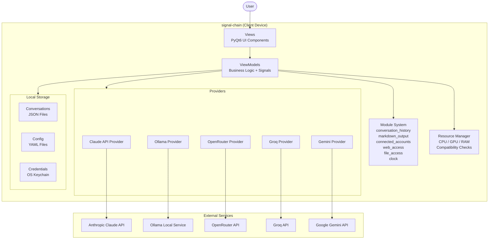
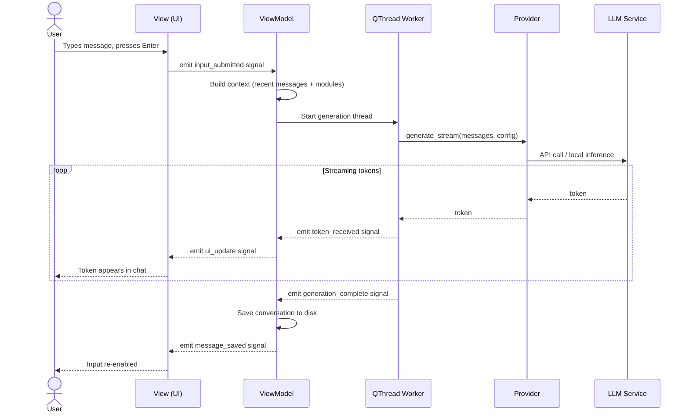
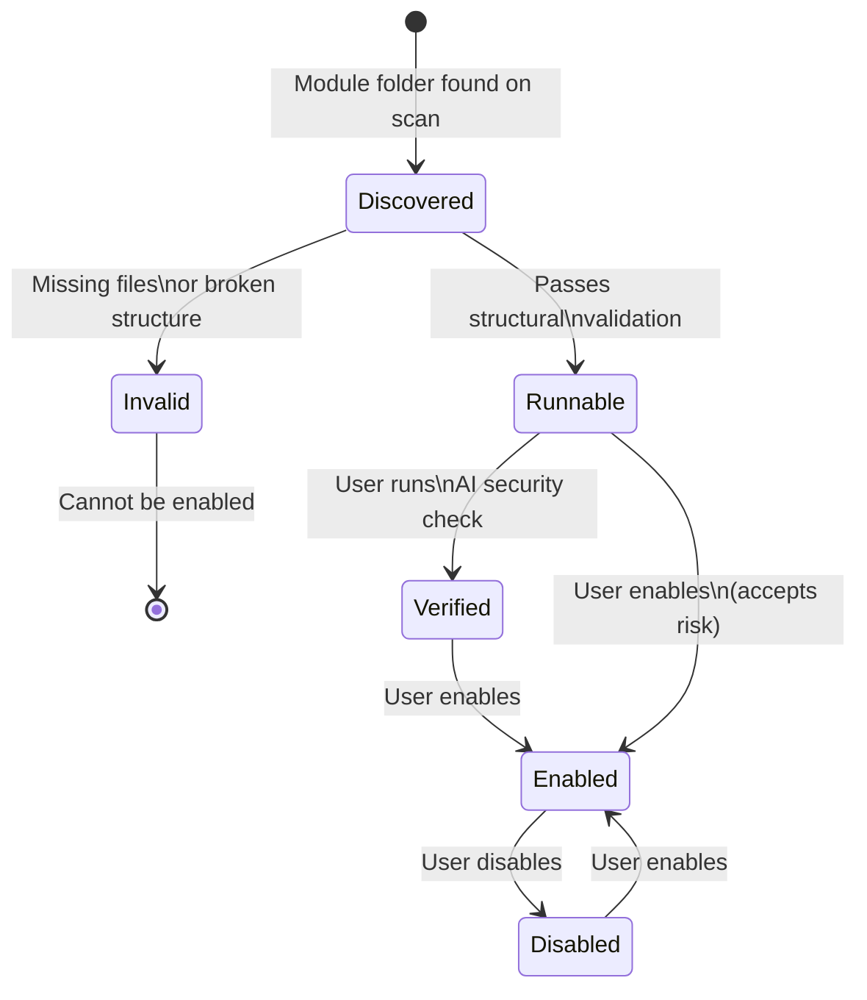
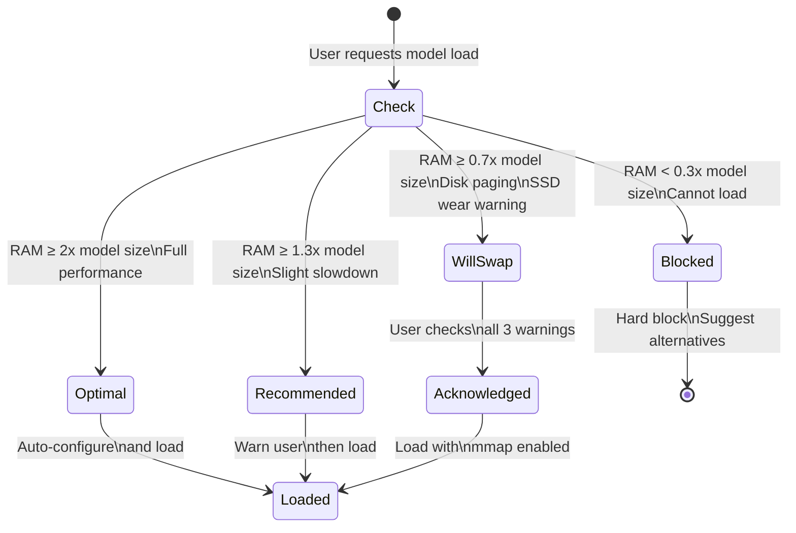

# System Diagrams

---

## Component Diagram

Shows the high-level parts of the system and how they connect.

---

## Sequence Diagram

Shows what happens step by step when a user sends a message.

---

## Module State Diagram

Shows the validation states a module can be in.

---

## Resource Tier State Diagram

Shows how the application responds to available RAM when loading a model.

